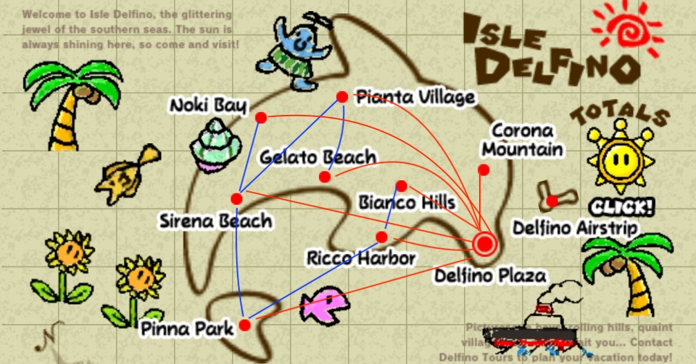

# Actividad Integral 3
Israel Iván Arroyo Parada
A01706190
## Table of contents
* [Información general](#información-general)
* [graph](#graph)
* [RBT](#rbt)
* [Map.h](#map)
* [Splay.h](#splay.h)
* [Node.h](#node.h)
* [Location.h](#location.h)
* [File.h](#file.h)
* [Casos de prueba](#casos-de-prueba)

## Información general
Este programa presenta un tablero con varias ubicaciones, entre ellas, la del usuraio.
En esta entrega se cambia la manera de almacenar las ubicaciones en el mapa, ahora se ordena y almacena con un árbol Red-Black. También se integra una memoria de los lugares que se han visitado en forma de un Splay Tree.
El mapa utilizado como referencia es el siguiente:

Sus conexiones son:

        0 Pianta_Village  Conexiones: 2 8
        1 Noki_Bay  Conexiones: 2
        2 Sirena_Beach  Conexiones: 4
        3 Bianco_Hills  Conexiones: 5
        4 Pina_Park Conexiones:
        5 Ricco_Harbor  Conexiones: 4
        6 Corona_Mountain Conexiones:
        7 Delfino_Plaza Conexiones: 0 1 2 3 4 5 6 8
        8 Gelato_Beach  Conexiones:

## graph
Funciona como un mapa de rutas entre las localidades de Isle Delfino. Este recibe un archivo txt que establece las rutas que se pueden seguir entre las localidades.
Tiene un tiempo de **O(n^2)** Por la operación de carga. Sus funciones más importantes son:
### loadGraphMat
Esta función corre en un tiempo de **O(n^2)**, pues se debe inicializar con 0 cada valor en la matriz, de tamaño N*N. Además, en el peor de los casos se debe recorrer la matriz entera si se tiene una relación con cada nodo.
### DFS (Ruta 1)
Tiene un tiempo de **O(n)**. Esta búsqueda funciona como un stack, con recursividad, para se visitar cada nodo una sola vez. Esto quiere decir que se hace un recorrido de todos los elementos del Grafo, hasta llegar al nodo deseado. En el peor de los casos este nodo se encontraría al final del recorrido, haciendo necesario el recorrido del Grafo entero.
### BFS (Ruta 2)
Esta búsqueda también tiene un tiempo de **O(n)**, es bastante parecido al DFS.La diferencia se encuentra en que está implementado con un queue y se hace un recorrido por niveles. A pesar de esto, permanece la restricción de visitar una sola vez cada nodo. Esto lo hace O(n).
## RBT(Estructura extra)
Esta estructura es utilizada como un almacén de localidades en la clase Map.
### Investigación
Este árbol parte de un BST y agrega restricciones nuevas para evitar casos degenerados, en donde se tenga, básicamente, una lista larga y se deban recorrer todos los elementos. Para lograr esto se tienen restricciones no tan estrictas, en donde no se permiten cargas mayores del lado derecho o izquierdo, en cualquier nodo.
Se tienen varias reglas para evitar este desbalanceo. Su característica principal es el color de cada nodo, de esta característica salen las restricciones de esta estructura.
- Solo existen nodos negros y rojos.
- La raíz debe ser negra.
- La inserción se hace con nodos rojos.
- No puede haber dos nodos rojos juntos. Lidio con este caso cuando hago una inserción en el árbol
- La cantidad de nodos negros debe ser la misma en cada camino posible del árbol. Lidio con esto cuando se elimina un nodo.
### Ejemplos
Los árboles auto balanceados son muy utilizados en el almacenaje de datos, pues se pueden hacer búsquedas e inserciones rápidas a pesar de tener muchos datos (Stone, J.,2015).
Los árboles Red-Black hacen operaciones menos costosas para balancearse (comparado con un AVL), pero son un poco más estrictos que un Splay tree.
- Búsquedas rápidas: En una base de datos pequeña en la que sea necesario tener los datos mucho más cerca de la raíz.
- Alta capacidad de cómputo: Un sistema como una Raspberry con mayor cantidad de cómputo que deba mantener datos de manera ordenada.
- Organizador de tareas de Linux: se puede tener una buena utilización de la memoria y mantener velocidades óptimas, de acuerdo con Mandrekar, P. (2013)
## Map
Map cambia, con respecto a sus versiones anteriores, con la implementación de un árbol Red Black (discutido más a fondo en su respectiva sección) para almacenar todas las locaciones dadas por el archivo txt.
### find()
Esta operación está garantizada a ser **O(logn)**, utiliza como apoyo el find de  RBT.h. Al tener las restricciones de un árbol Red-Black, no se presentan casos degenerados. El peor de los casos se sigue tratando con un árbol balanceado.

### find()
Esta función tiene un tiempo de **O(logn)**, como se habia mencionado en la anterior sección. Sin tomar en cuenta la función check().
### remove() y add()
Ocurre los mismo que con la función find(), tiene un tienmpo de **O(logn)**. El recorrido de buscar el valor y eliminarlo está garantizado a ser logn. Esto es, sin considerar que se manda a llamar a check, que tiene otra complejidad.
### check()
Tiene una complejidad de **O(logn)**. Con la implementación de parent en los nodos, se logra recorrer solo la rama modificada. Se toma el nodo añadido o eliminado y se hace un recorrido hasta el nodo
### balance()
Su complejidad es constante **O(1)**. Cada operación de rotación mueve una cantidad definida de apuntadores. Dependiendo del caso aumenta la cantidad de apuntadores que se mueven, pero esto es independiente del tamaño del árbol (Geeks for Geeks, 2020))
## Splay.h
De acuerdo con (Geeks for Geeks, 2019), cualquier operacion de un Splay tree tiene un tiempo de **O(logn)**. Pero es importante aclarar que se puede llegar a un caso **O(n)**, si las inserciones llevan a un árbol degenerado. En este caso, se tomará un caso común con un árbol balanceado con complejidad promedio de O(logn).
### Splay()
Tiene una complejidad **O(logn)**. Esto se debe al recorrido que se debe hacer para llevar un nodo a la raíz. En el peor de los casos se haría un Splay en una hoja y se tendría que hacer un recorrido por cada nivel, resultando en un tiempo de O(logn)
### find()
Si tenemos en cuenta un árbol balanceado, se trata de una complejidad de **O(logn)**. Este es el caso promedio, solo solo se sigue el camino para llegar a el nodo deseado, haciendo una operacion por cada nivel.
### remove() y add()
Igualmente, tienen un tiempo de **O(logn)**. Sucede lo mismo que con find(). En estos tres casos se debe aclarar que no se toma en cuenta la operación Splay.

## Node.h
Contiene los nodos utilizados por las estructuras Red-Black y SplayTree. Contiene las funciones auxiliares para hacer búsquedas, eliminaciones, impresiones, etc. Estas funciones auxiliares tienen la complejidad discutida en cada árbol que la utiliza.
## QueueMap.h
### qFind()
La función de find en una lista ligada corre en un tiempo de **O(n)**. Solo es posible recorrer esta estructura de nodo a nodo, hasta encontrar el valor deseado o haber recorrido la lista entera.
### enqueue()
Agregar un elemento a la lista tiene un tiempo de **O(1)**. Ya que en un queue solo es posible añadir elementos hasta el final de la lista, el tiempo es estrictamente constante.
### dequeue()
El tiempo de dequeue es  **O(1)**. Al igual que enqueue, solo se peude acceder a una localidad de la lista. En este caso solo se elimina el primer elemento de la lista.
## Location.h
Objeto que almacena el nombre de la ubicación y las coordenadas de dicho lugar. Despés calcula la disatancia con respecto a una ubicación dada.
### calcDistance
Toma los valores de X y de Y de un punto dado y los propios del objeto. Con esto, usando el teorema de pitágoras, se calcula la distancia entre los dos puntos y se asigna a la propiedad "distance".
## File.h
Lee un archivo txt y escribe un nuevo archivo la lista de ubicaciones ordenadas. El formato debe ser:
> "Nombre" "X" "Y"
El formato de salida es:
> "Nombre" "(X,Y)" "Distancia del punto dado"

# Casos de prueba
Los casos de pureba se encuentran en el archivo test.cpp. Ahí se hacen pruebas para las funciones más imortatntes.
## Caso 1
### Input:
Coordenadas iniciales (0,0)
#### Locaciones ingresadas:
"miCasa 56 64" distancia 85
"tuCasa 24 80" distancia 83
"vineria 100 100" distancia 141
"cafeteria 60 20" distancia 63
#### Output:
Caso 1 Enqueue
[miCasa 56 64, tuCasa 24 80, vineria 100 100, cafeteria 60 20]

## Caso 2
### Input:
Coordenadas iniciales (0,0)
(Output pasado) [miCasa 56 64, tuCasa 24 80, vineria 100 100, cafeteria 60 20]
#### Dequeue 2 veces.
### Output:
Caso 2 Dequeue
[vineria 100 100, cafeteria 60 20]

## Caso 3
### Input:
Coordenadas iniciales (0, 0)
#### Locaciones ingresadas:
"miCasa 56 64" distancia 85
"tuCasa 24 80" distancia 83
"vineria 100 100" distancia 141
"cafeteria 60 20" distancia 63
### Output
#### Construcción de árbol
                85 miCasa
                  /    \
                /        \
                83 tuCasa  141 vineria
                /
                63 cafeteria
Caso 3 Red-Black add
1. in order: [cafeteria 60 20 , tuCasa 24 80 , miCasa 56 64 , vineria 100 100]
2. pre order: [miCasa 56 64 , tuCasa 24 80 , cafeteria 60 20 , vineria 100 100]

## Caso 4
### Input
Coordenadas iniciales (0,0)
1. Encontrar 83
2. Eliminar tuCasa
### Output
Caso 4 Red-Black find & remove
1. tuCasa 24 80
2. in order: [cafeteria 60 20 , miCasa 56 64 , vineria 100 100]
2. pre order:[miCasa 56 64 , cafeteria 60 20 , vineria 100 100]

## Caso 5
### Input
Coordenadas iniciales (0,0)
#### Locaciones ingresadas:
"miCasa 56 64" distancia 85
"tuCasa 24 80" distancia 83
"vineria 100 100" distancia 141
"cafeteria 60 20" distancia 63
#### Output
                63 cafeteria
                 \
                141 vineria
                /
                85 miCasa
                \
                83 tuCasa

1. in order: [cafeteria 60 20 , tuCasa 24 80 , miCasa 56 64 , vineria 100 100]
2. pre order: [cafeteria 60 20 , vineria 100 100 , tuCasa 24 80 , miCasa 56 64]

## Caso 6
### Input
Coordenadas iniciales (0,0)
1. Encontrar tuCasa
2. Eliminar tuCasa
#### Output
Caso 6 SplayTree find & remove
1. in order:  [cafeteria 60 20 , tuCasa 24 80 , miCasa 56 64 , vineria 100 100]
1. pre order: [tuCasa 24 80 , cafeteria 60 20 , vineria 100 100 , miCasa 56 64]
2. in order: [cafeteria 60 20 , miCasa 56 64 , vineria 100 100]
2. pre order: [cafeteria 60 20 , vineria 100 100 , miCasa 56 64]
## Referencias
Geeks for Geeks. (2020). Red-Black Tree | Set 2 (Insert). 18 de nov. 2020, Sitio web: https://www.geeksforgeeks.org/red-black-tree-set-2-insert/

Geeks for Geeks. (2019). Splay Tree | Set 1 (Search). 1 de nov. 2020, Sitio web: https://www.geeksforgeeks.org/splay-tree-set-1-insert/

Stone, J. (2015). What are some real-world applications of AVL trees today?. 1 de nov. 2020, de Quora Sitio web: https://www.quora.com/What-are-some-real-world-applications-of-AVL-trees-today?share=1

Mandrekar, P. (2013). What are some real-world applications of Red-Black trees today?. 18 de nov. 2020, de Quora Sitio web: https://www.quora.com/What-are-some-real-world-applications-of-Red-Black-trees-today?share=1
